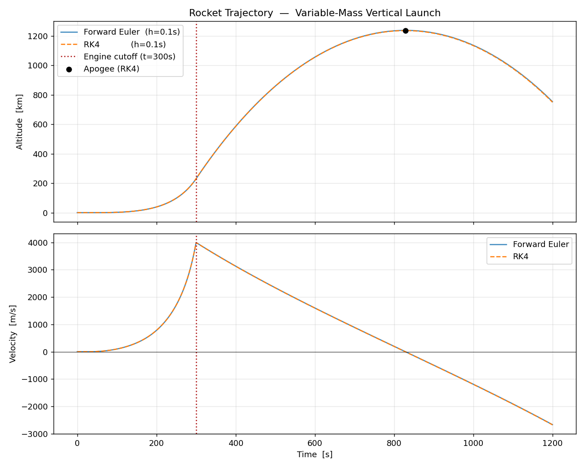
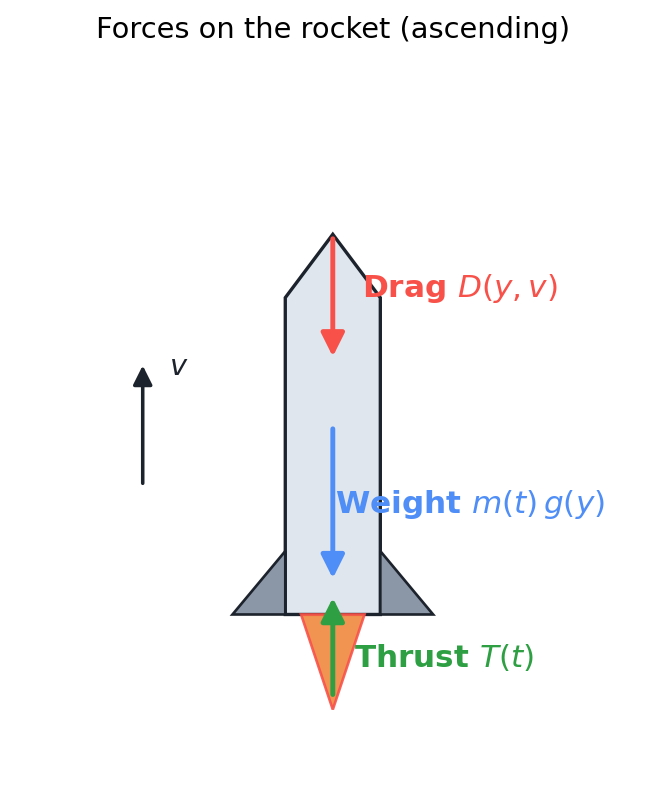
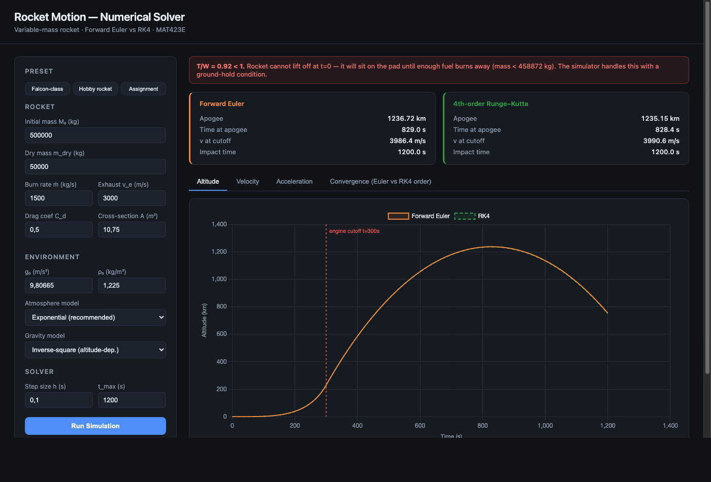

# Numerical Simulation of Rocket Flight

> Vertically-launched, variable-mass rocket. Forward Euler vs RK4 on the coupled
> `(y, v)` ODE system, with altitude-dependent gravity, exponential atmosphere,
> quadratic drag, and a ground-hold gate for sub-unity initial T/W. Built for
> *MAT423E — Numerical Solutions of ODEs.*

**Live demo:** [mat423.vercel.app](https://mat423.vercel.app)



---

## What the simulation does

A 500-tonne rocket burns fuel at `ṁ = 1500 kg/s`, ejected at `vₑ = 3000 m/s`,
giving a constant thrust of `T = ṁ·vₑ = 4.5 MN` until the propellant runs out
at `t_b = 300 s`. The rocket is modelled as a point mass moving vertically;
state is `(y, v)`. Two integrators march it forward — Forward Euler (1st order)
and classical RK4 (4th order) — and the convergence behaviour of both is
measured against a refined-step RK4 reference.

The script `rocket_simulation.py` prints a summary and writes `trajectory.png`.
The HTML demo (`rocket_simulator.html`) is the same physics in JavaScript, with
parameter sliders and live Chart.js plots.

## The model



**State.** Altitude `y(t)` and velocity `v(t)`. Mass is closed-form in `t`, so
it isn't carried in the state vector.

**Equations of motion.**

$$\frac{dy}{dt} = v$$

$$\frac{dv}{dt} = \frac{T(t) \;-\; m(t)\,g(y) \;-\; \tfrac{1}{2}\,\rho(y)\,C_d\,A\,v\,\lvert v\rvert}{m(t)}$$

The drag term uses `v·|v|` so the force always opposes velocity — same expression for ascent and descent.

**Environment.**

$$g(y) = g_0\left(\frac{R_E}{R_E + y}\right)^2 \qquad \rho(y) = \rho_0\,e^{-y/H}$$

with `g₀ = 9.80665 m/s²`, `R_E = 6.371 × 10⁶ m`, `ρ₀ = 1.225 kg/m³`, `H = 8500 m`.

**Mass and thrust schedules.**

$$m(t) = \begin{cases} M_0 - \dot{m}\,t & t \le t_b \\ M_\text{dry} & t > t_b \end{cases} \qquad T(t) = \begin{cases} \dot{m}\,v_\text{exh} & t \le t_b \\ 0 & t > t_b \end{cases}$$

## Why T/W < 1 matters

With the assignment parameters:

| Quantity | Value |
|---|---|
| Initial weight `W₀ = M₀·g` | 4.903 MN |
| Constant thrust `T = ṁ·vₑ` | 4.500 MN |
| **Initial thrust-to-weight** | **0.918** |

Because `T < W₀`, the rocket cannot accelerate upward at `t = 0`. Engines fire
and consume propellant while it sits on the pad. Lift-off happens only once
mass has dropped to `M_lift = T/g ≈ 458,876 kg`, which takes
`(M₀ − M_lift)/ṁ ≈ 27.4 s` of burning fuel for nothing.

To keep the ODE physical, `rhs()` clamps acceleration to zero whenever
`y ≤ 0`, `v ≤ 0`, and the net force is still downward:

```python
if y <= 0.0 and v <= 0.0 and F_net <= 0.0:
    return np.array([0.0, 0.0])      # held on the pad
```

Without this gate Euler/RK4 would tunnel through the ground in the first few steps.

## Numerical methods

Both solvers march the same state vector `s = [y, v]` with fixed step `h`.

**Forward Euler** (1st order, one RHS eval/step):

$$s_{n+1} = s_n + h \cdot f(t_n,\, s_n)$$

**Classical RK4** (4th order, four RHS evals/step):

$$
\begin{aligned}
k_1 &= f(t_n,\, s_n) \\
k_2 &= f(t_n + h/2,\, s_n + (h/2) k_1) \\
k_3 &= f(t_n + h/2,\, s_n + (h/2) k_2) \\
k_4 &= f(t_n + h,\, s_n + h\, k_3) \\
s_{n+1} &= s_n + \tfrac{h}{6}\,(k_1 + 2k_2 + 2k_3 + k_4)
\end{aligned}
$$

Both integrators terminate when the rocket has come back down (`y < 0` after `t > 1 s`) or when `t_max` is reached.

## Results

Default parameters, `h = 0.1 s`, `t_max = 1200 s`:

| Solver | Apogee | Time at apogee | v at cutoff | Flight ends at |
|---|---|---|---|---|
| Forward Euler | 1236.72 km | 829.0 s | 3986.4 m/s | t_max (1200 s) |
| RK4           | 1235.15 km | 828.4 s | 3990.6 m/s | t_max (1200 s) |

A Tsiolkovsky sanity check (no losses) gives an ideal burnout speed of
`vₑ · ln(M₀/M_dry) = 3000 · ln(10) ≈ 6908 m/s`. The observed burnout speed of
~3990 m/s implies a combined gravity-plus-drag loss of ~2918 m/s, which lines
up with the analytical gravity loss `g · t_b = 9.80665 · 300 ≈ 2942 m/s` for a
straight-up trajectory — drag accounts for the small remainder.

**Convergence study** (apogee in km, ref = RK4 at `h = 0.01 s`):

| h [s] | Euler apogee | RK4 apogee |
|---:|---:|---:|
| 2.000 | 1180.11 | 1216.99 |
| 1.000 | 1206.81 | 1225.61 |
| 0.500 | 1220.45 | 1229.94 |
| 0.100 | 1236.72 | 1235.15 |
| 0.050 | 1232.89 | 1233.85 |
| 0.010 | 1234.53 | 1234.37 |

The log–log error vs `h` plot (HTML "Convergence" tab) shows the expected
slopes — 1 for Euler, 4 for RK4.

## Interactive demo



The HTML demo (`rocket_simulator.html`) re-implements the same physics in plain
JavaScript with Chart.js. It has parameter inputs, three presets
(Assignment / Falcon-class / Hobby rocket), atmosphere and gravity model
toggles, and four chart tabs (altitude, velocity, acceleration, convergence).

## Run it

### Python script

```bash
uv venv && uv pip install -e ".[dev]"
uv run python rocket_simulation.py
# → writes trajectory.png and prints the summary above
```

Plain pip works too: `python3 -m venv .venv && source .venv/bin/activate && pip install -e ".[dev]"`.

### Jupyter notebook

```bash
uv run jupyter lab rocket_simulation.ipynb
```

The notebook walks through the physics cell by cell — same numbers as the script, plus the per-step inspection plots and the engine-cutoff zoom.

### HTML demo

Open `rocket_simulator.html` in a browser. No server needed; Chart.js loads from a CDN.

## Repository layout

```
.
├── rocket_simulation.py        ← standalone Python entry point
├── rocket_simulation.ipynb     ← annotated notebook
├── rocket_simulator.html       ← interactive web demo
├── trajectory.png              ← headline output figure
├── figs/
│   ├── free_body.png           ← README diagram
│   ├── demo.png                ← README screenshot of the HTML demo
│   └── generate_free_body.py   ← rebuild script for free_body.png
├── pyproject.toml
├── .python-version
└── README.md
```

## Requirements

- Python ≥ 3.10 (tested on 3.14), `numpy`, `matplotlib`
- Any modern browser for the HTML demo

All Python deps are listed in `pyproject.toml`.

## License

MIT — see `LICENSE`.
